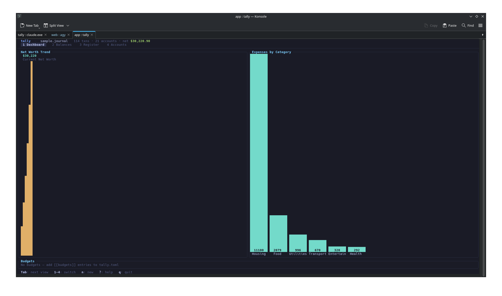
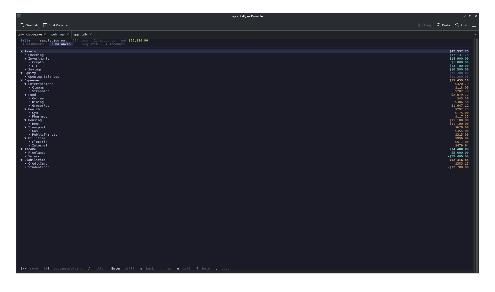
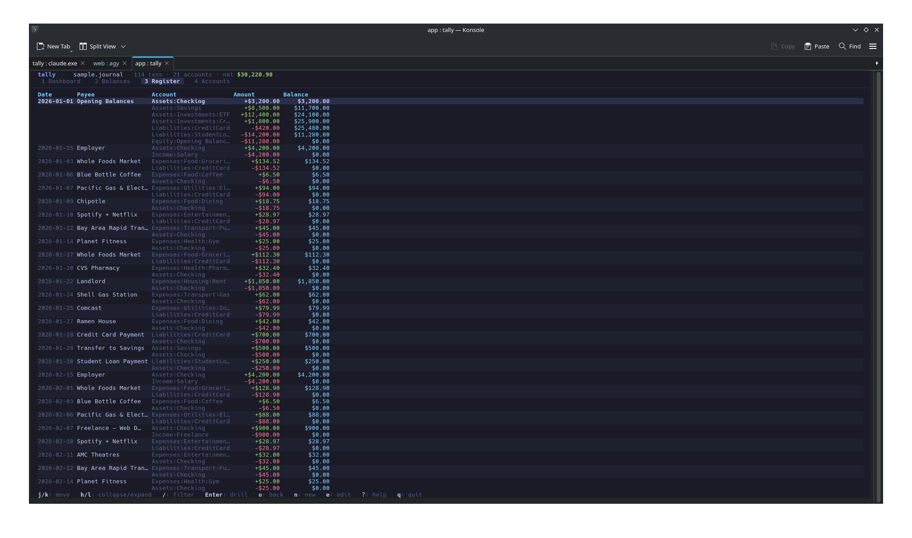
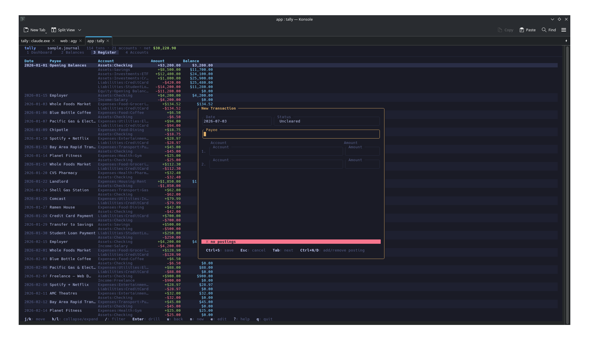
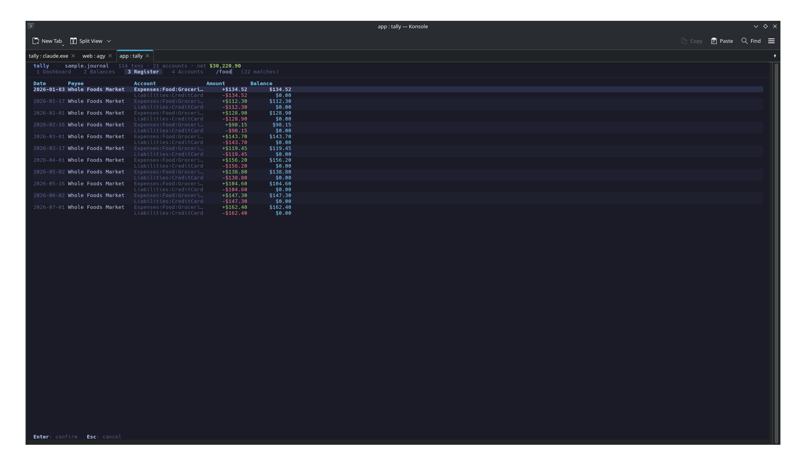

<div align="center">
  

  <p><strong>Plain-text, double-entry accounting for the terminal.</strong></p>

  <p><em>ledger's data model, a modern terminal experience.</em></p>

  [](https://github.com/murtazapatel89100/Tally/actions/workflows/ci.yml)
  [](LICENSE)
  [](https://tally.rs)
  
</div>

---

Tally is a modern, plain-text accounting tool — like [`ledger`](https://www.ledger-cli.org/)
and [`hledger`](https://hledger.org/), but written in Rust with a fast, polished TUI.

It reads standard ledger/hledger journal files (so you can switch instantly) and layers
modern conveniences on top: first-class tags, friendly parse errors, budgets, and an
interactive terminal UI for exploring, entering, and visualizing your finances.

## Table of contents

- [Features](#features)
- [Screenshots](#screenshots)
- [Install](#install)
- [Quick start](#quick-start)
- [Journal format](#journal-format)
- [CLI reference](#cli-reference)
- [TUI key bindings](#tui-key-bindings)
- [Configuration](#configuration-tallytoml)
- [Documentation](#documentation)
- [Repository layout](#repository-layout)
- [Contributing](#contributing)
- [License](#license)

## Features

- 📄 **ledger / hledger compatible** — reads standard `.journal` files; switch with zero migration.
- ➗ **Exact decimal arithmetic** — no floating-point rounding surprises in your books.
- 🌲 **Rich reports** — hierarchical balances, register with running totals, canonical `print`.
- 🖥️ **Interactive TUI** — Dashboard, Balances tree, Register, and Accounts views with
  vim-style navigation, live filtering, and mouse + page scrolling.
- ✍️ **In-app entry & edit** — add and edit transactions in the TUI with fuzzy account
  autocomplete, live balance checking, and auto-balancing of a blank posting.
- 📊 **Dashboard & budgets** — net-worth sparkline, top-expense bar charts, and monthly
  budget gauges driven by your config.
- 🎨 **Themes** — Tokyo Night (dark), Nord, and light.
- 🔎 **Friendly errors** — parse problems point at the exact line with a helpful message.
- 📦 **Single self-contained binary** — no runtime, no dependencies.

## Screenshots

| Dashboard | Balances | Register |
|-----------|----------|----------|
|  |  |  |

| Transaction entry | Filtering |
|-------------------|-----------|
|  |  |

## Install

```sh
cargo install tally
```

Or download a pre-built binary from the [releases page](https://github.com/murtazapatel89100/Tally/releases)
(Linux x86_64/ARM64, macOS x86_64/ARM64, Windows x86_64).

### Shell completions

```sh
tally completions bash  >> ~/.bash_completion
tally completions zsh   > ~/.zfunc/_tally
tally completions fish  > ~/.config/fish/completions/tally.fish
```

## Quick start

```sh
export TALLY_FILE=~/finance/2026.journal

tally           # open the TUI
tally bal       # account balances
tally reg       # posting register
tally accounts  # list accounts
tally print     # canonical re-serialization
```

Point Tally at a journal with `-f/--file`, the `TALLY_FILE` environment variable, or
`LEDGER_FILE` (for hledger compatibility).

## Journal format

Tally reads plain-text ledger/hledger journals:

```ledger
; Comments start with ;

account Assets:Checking
account Expenses:Food:Groceries

2026-01-15 * Employer                    ; * = cleared, ! = pending, blank = uncleared
    Assets:Checking      $4,200.00
    Income:Salary       $-4,200.00

2026-01-03 * Whole Foods Market
    Expenses:Food:Groceries  $134.52
    Liabilities:CreditCard             ; amount omitted → inferred to balance
```

See the [journal format reference](https://tally.rs/format/) for the full grammar, and
[`app/examples/sample.journal`](app/examples/sample.journal) for a complete example.

## CLI reference

| Command | Description |
|---------|-------------|
| `tally` | Open the interactive TUI (default) |
| `tally bal [ACCOUNT]` | Hierarchical account balances |
| `tally reg [ACCOUNT]` | Posting register with running total |
| `tally accounts` | List all known accounts |
| `tally print` | Print the journal in canonical, ledger-compatible form |
| `tally completions <SHELL>` | Generate shell completions (bash/zsh/fish) |

**Global options & filters:**

| Flag / env | Description |
|------------|-------------|
| `-f, --file <PATH>` | Journal file to read |
| `TALLY_FILE` / `LEDGER_FILE` | Journal file (env fallbacks) |
| `--from <YYYY-MM-DD>` | Start date filter (`bal`, `reg`) |
| `--to <YYYY-MM-DD>` | End date filter (`bal`, `reg`) |
| `[ACCOUNT]` | Account-prefix filter, e.g. `Expenses:Food` |

## TUI key bindings

| Key | Action |
|-----|--------|
| `1/d` | Dashboard (sparkline, charts, budgets) |
| `2/b` | Balances tree |
| `3/r` | Register |
| `4/a` | Accounts list |
| `Tab` | Cycle views |
| `j/k` `↓/↑` | Move down / up |
| `g/G` | Top / bottom |
| `PgDn/PgUp`, `Ctrl+d/Ctrl+u` | Page / half-page scroll |
| `/` | Filter (payee / account) |
| `Enter` | Drill into register |
| `Space` | Toggle collapse (Balances); `[` / `]` collapse / expand all |
| `n` | New transaction |
| `e` | Edit transaction (Register) |
| `u` / `Esc` | Back / clear filter |
| `?` | Help |
| `q` | Quit |

Mouse scroll and click-to-select are supported. In the entry form, `Tab`/`Shift+Tab`
move between fields, `Ctrl+n`/`Ctrl+d` add/remove a posting, and `Ctrl+s` saves.

See the [keybindings reference](https://tally.rs/keybindings/) for the complete list.

## Configuration (`tally.toml`)

```toml
file = "~/finance/2026.journal"
theme = "dark"   # "dark" (Tokyo Night), "nord", or "light"

[[budgets]]
account = "Expenses:Food"
monthly = 600.00
label = "Food"

[[budgets]]
account = "Expenses:Utilities"
monthly = 150.00
```

Place `tally.toml` in the current directory or in `~/.config/tally/`. See the
[configuration reference](https://tally.rs/config/) for all options.

## Documentation

Full documentation lives at **[tally.rs](https://tally.rs)**:

- [Installation](https://tally.rs/install/)
- [Journal format](https://tally.rs/format/)
- [Commands](https://tally.rs/commands/)
- [Keybindings](https://tally.rs/keybindings/)
- [Configuration](https://tally.rs/config/)

## Repository layout

| Path | Description |
|------|-------------|
| `app/` | Rust workspace — `tally-core` library + `tally` binary |
| `web/docs/` | Astro + Starlight documentation & landing site ([tally.rs](https://tally.rs)) |
| `web/app/` | Web GUI version of the CLI (planned, WASM-powered) |
| `.github/workflows/` | CI (fmt, clippy, tests, proptest) + release pipeline |

## Contributing

Contributions are welcome! Please read [CONTRIBUTING.md](CONTRIBUTING.md) for how to build,
test, and submit changes, and see [ROADMAP.md](ROADMAP.md) for planned work. By participating
you agree to the [Code of Conduct](CODE_OF_CONDUCT.md). Changes are logged in
[CHANGELOG.md](CHANGELOG.md); to report a security issue see [SECURITY.md](SECURITY.md).

## License

Licensed under the [MIT License](LICENSE).
